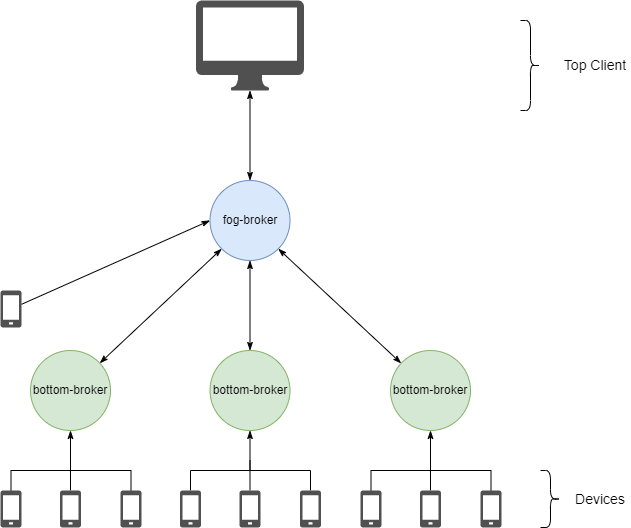

# soft-iot-dlt-fog-broker

## Descrição

O `soft-iot-dlt-fog-broker` é o *bundle* responsável por realizar o cálculo de [Top-K](https://www.sciencedirect.com/science/article/abs/pii/S002002551830714X#:~:text=A%20Top-k%20retrieval%20algorithm%20returns%20the%20k%20best%20answers,take%20into%20consideration%20execution%20time.) dos dispositivos a partir de uma requisição feita por um *Client* superior. Ele utiliza o protocolo MQTT, tanto para receber quanto para enviar requisiçõe. Para realizar o cálculo, este *bundlle* pede para a camada de baixo (caso exista) o Top-K dos dispositivos que estão conectadas com ela. Com base nas respostas das camadas inferiores, ele recalcula o Top-K, e então devolve  o resultado para o *Client* que solicitou.

Atualmente o `soft-iot-dlt-fog-broker` trabalha junto com o [`SOFT-IoT-Bottom-Broker`](https://github.com/larsid/SOFT-IoT-Bottom-Broker), sendo que este último está em uma camada abaixo do `soft-iot-dlt-fog-broker`.

### Modelo da arquitetura

  

## Configurações

Propriedade | Descrição | Valor Padrão
------------|-----------|-------------
IP | Endereço IP para conexão com o *Broker* | localhost
Port | Porta para conexão com o *Broker* | 1883
user | Usuário para conexão com o *Broker* | karaf
pass | Senha para conexão com o *Broker* | karaf
debugModeValue | Modo depuração | true
childs¹ | Quantidade de filhos na camada abaixo | 1

###### Obs¹: Quantidade de `SOFT-IoT-Bottom-Broker` conectados com o `soft-iot-dlt-fog-broker`.
